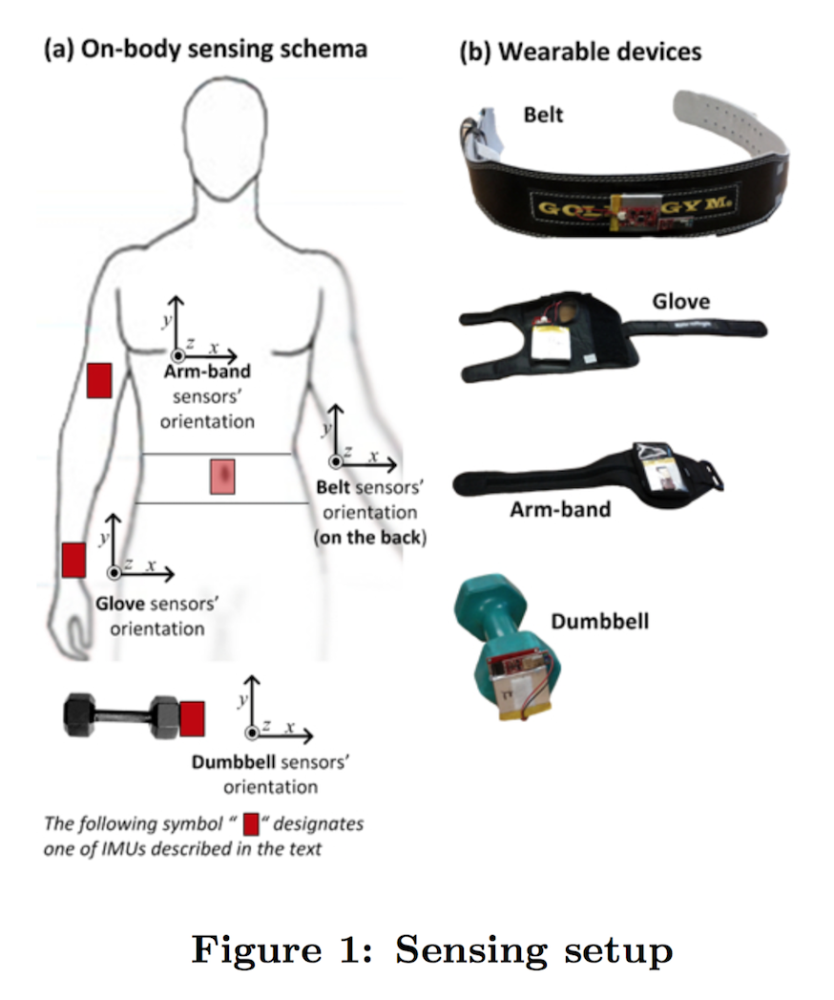

# Qualitative physical activity recognition using sensors data
[Romain Faure](https://github.com/cdromain)  
March 2017  

# Introduction

Using personal *wearable* monitoring devices, it is now possible to collect a large amount of data about personal activity relatively inexpensively. These type of devices are part of the *quantified self movement* – a group of enthusiasts who take measurements about themselves regularly to improve their health or find patterns in their behavior. In parallel, *Human Activity Recognition (HAR)* has emerged as a key research area in the last years.

Usually, people tend to quantify how much of a particular activity they do, or discriminate between different activities (i.e. predict which activity they do at a specific point in time), but they rarely quantify *how well* they perform a specific activity. 

In this project, our goal will be to use the Weight Lifting Exercises data set, i.e. data captured by **on-body sensors** that were placed on the belt, forearm, arm, and dumbell of $6$ male participants (aged between 20-28 years), to predict how they actually did the exercise. *Figure 1* below shows the experiment setup that was used ([source](http://groupware.les.inf.puc-rio.br/public/papers/2013.Velloso.QAR-WLE.pdf)) :



The participants were asked to perform one set of $10$ repetitions of the unilateral dumbbell biceps curl (a biceps curl repetition involves raising and lowering the dumbbell) in $5$ different ways : correctly, i.e. exactly according to the specified execution of the exercise (class A), or incorrectly, like throwing the elbows to the front (class B), lifting the dumbbell only halfway (class C), lowering the dumbbell only halfway (class D) and throwing the hips to the front (class E).

The aim of this experiment was to investigate the feasibility of automatically assessing the quality of execution of weight lifting exercises - so-called **qualitative activity recognition**.

Therefore, we are here dealing with a **classification** problem. More specifically, our goal in this project is to build a prediction model capable of identifying the manner in which the participants did the exercise (i.e. the `classe` variable in the training set, our outcome), classifying every observation in one of the $5$ classes using the remaining variables in the training set.

> More information is available on this [website](http://groupware.les.inf.puc-rio.br/har#weight_lifting_exercises) and in this [paper](http://groupware.les.inf.puc-rio.br/public/papers/2013.Velloso.QAR-WLE.pdf).

# Loading the data and the necessary packages

We start by downloading the data using the script below :


```r
# Data downloading

## Check if a "data" directory exists in the current working directory
## and create it if not

if (!file.exists("data")) { 
        dir.create("data")
}

## Check if the 2 data files already exist in the "data" directory
## and download them if not

if (!file.exists("./data/pml-training.csv")) { 
        ## download the training data CSV file
        fileUrl1 <- "https://d396qusza40orc.cloudfront.net/predmachlearn/pml-training.csv"
        download.file(fileUrl1, "./data/pml-training.csv", method = "curl")
}

if (!file.exists("./data/pml-testing.csv")) { 
        ## download the test data CSV file
        fileUrl2 <- "https://d396qusza40orc.cloudfront.net/predmachlearn/pml-testing.csv"
        download.file(fileUrl2, "./data/pml-testing.csv", method = "curl")
}
```

We then load the packages necessary for our analysis, set the seed for reproducibility purposes and read in the downloaded training and test data CSV files (specifying that empty cells should be interpreted as NA using `read.csv`'s `na.strings` argument) :


```r
## Loading the necessary packages
library(caret)
library(randomForest)
library(VIM)
library(psych)
library(ggplot2)
library(parallel); library(doParallel)

## setting the seed
set.seed(777)

## Reading in the training and test data files
training <- read.csv(file = "./data/pml-training.csv", header = TRUE, na.strings = c("", "NA"))
test <- read.csv(file = "./data/pml-testing.csv", header = TRUE, na.strings = c("", "NA"))
```

# Exploratory Data Analysis

We start by checking the dimensions of the `training` data frame :


```
## Numbers of rows :
```

```
## [1] 19622
```

```
## Numbers of columns :
```

```
## [1] 160
```

Our training set has $19622$ observations (rows) and $160$ variables (columns).

We then check if the training set contains missing data (`NA`), using the `aggr` function from the [`VIM` package](https://cran.r-project.org/web/packages/VIM/index.html). This function outputs a plot showing the proportion of variables containing missing values, as well as a list of the variables sorted by number of missing values : 


<!-- -->

```
## 
##  Variables sorted by number of missings: 
##                  Variable Count
##        kurtosis_roll_belt 19216
##       kurtosis_picth_belt 19216
##         kurtosis_yaw_belt 19216
##        skewness_roll_belt 19216
##      skewness_roll_belt.1 19216
##         skewness_yaw_belt 19216
##             max_roll_belt 19216
##            max_picth_belt 19216
##              max_yaw_belt 19216
##             min_roll_belt 19216
##            min_pitch_belt 19216
##              min_yaw_belt 19216
##       amplitude_roll_belt 19216
##      amplitude_pitch_belt 19216
##        amplitude_yaw_belt 19216
##      var_total_accel_belt 19216
##             avg_roll_belt 19216
##          stddev_roll_belt 19216
##             var_roll_belt 19216
##            avg_pitch_belt 19216
##         stddev_pitch_belt 19216
##            var_pitch_belt 19216
##              avg_yaw_belt 19216
##           stddev_yaw_belt 19216
##              var_yaw_belt 19216
##             var_accel_arm 19216
##              avg_roll_arm 19216
##           stddev_roll_arm 19216
##              var_roll_arm 19216
##             avg_pitch_arm 19216
##          stddev_pitch_arm 19216
##             var_pitch_arm 19216
##               avg_yaw_arm 19216
##            stddev_yaw_arm 19216
##               var_yaw_arm 19216
##         kurtosis_roll_arm 19216
##        kurtosis_picth_arm 19216
##          kurtosis_yaw_arm 19216
##         skewness_roll_arm 19216
##        skewness_pitch_arm 19216
##          skewness_yaw_arm 19216
##              max_roll_arm 19216
##             max_picth_arm 19216
##               max_yaw_arm 19216
##              min_roll_arm 19216
##             min_pitch_arm 19216
##               min_yaw_arm 19216
##        amplitude_roll_arm 19216
##       amplitude_pitch_arm 19216
##         amplitude_yaw_arm 19216
##    kurtosis_roll_dumbbell 19216
##   kurtosis_picth_dumbbell 19216
##     kurtosis_yaw_dumbbell 19216
##    skewness_roll_dumbbell 19216
##   skewness_pitch_dumbbell 19216
##     skewness_yaw_dumbbell 19216
##         max_roll_dumbbell 19216
##        max_picth_dumbbell 19216
##          max_yaw_dumbbell 19216
##         min_roll_dumbbell 19216
##        min_pitch_dumbbell 19216
##          min_yaw_dumbbell 19216
##   amplitude_roll_dumbbell 19216
##  amplitude_pitch_dumbbell 19216
##    amplitude_yaw_dumbbell 19216
##        var_accel_dumbbell 19216
##         avg_roll_dumbbell 19216
##      stddev_roll_dumbbell 19216
##         var_roll_dumbbell 19216
##        avg_pitch_dumbbell 19216
##     stddev_pitch_dumbbell 19216
##        var_pitch_dumbbell 19216
##          avg_yaw_dumbbell 19216
##       stddev_yaw_dumbbell 19216
##          var_yaw_dumbbell 19216
##     kurtosis_roll_forearm 19216
##    kurtosis_picth_forearm 19216
##      kurtosis_yaw_forearm 19216
##     skewness_roll_forearm 19216
##    skewness_pitch_forearm 19216
##      skewness_yaw_forearm 19216
##          max_roll_forearm 19216
##         max_picth_forearm 19216
##           max_yaw_forearm 19216
##          min_roll_forearm 19216
##         min_pitch_forearm 19216
##           min_yaw_forearm 19216
##    amplitude_roll_forearm 19216
##   amplitude_pitch_forearm 19216
##     amplitude_yaw_forearm 19216
##         var_accel_forearm 19216
##          avg_roll_forearm 19216
##       stddev_roll_forearm 19216
##          var_roll_forearm 19216
##         avg_pitch_forearm 19216
##      stddev_pitch_forearm 19216
##         var_pitch_forearm 19216
##           avg_yaw_forearm 19216
##        stddev_yaw_forearm 19216
##           var_yaw_forearm 19216
##                         X     0
##                 user_name     0
##      raw_timestamp_part_1     0
##      raw_timestamp_part_2     0
##            cvtd_timestamp     0
##                new_window     0
##                num_window     0
##                 roll_belt     0
##                pitch_belt     0
##                  yaw_belt     0
##          total_accel_belt     0
##              gyros_belt_x     0
##              gyros_belt_y     0
##              gyros_belt_z     0
##              accel_belt_x     0
##              accel_belt_y     0
##              accel_belt_z     0
##             magnet_belt_x     0
##             magnet_belt_y     0
##             magnet_belt_z     0
##                  roll_arm     0
##                 pitch_arm     0
##                   yaw_arm     0
##           total_accel_arm     0
##               gyros_arm_x     0
##               gyros_arm_y     0
##               gyros_arm_z     0
##               accel_arm_x     0
##               accel_arm_y     0
##               accel_arm_z     0
##              magnet_arm_x     0
##              magnet_arm_y     0
##              magnet_arm_z     0
##             roll_dumbbell     0
##            pitch_dumbbell     0
##              yaw_dumbbell     0
##      total_accel_dumbbell     0
##          gyros_dumbbell_x     0
##          gyros_dumbbell_y     0
##          gyros_dumbbell_z     0
##          accel_dumbbell_x     0
##          accel_dumbbell_y     0
##          accel_dumbbell_z     0
##         magnet_dumbbell_x     0
##         magnet_dumbbell_y     0
##         magnet_dumbbell_z     0
##              roll_forearm     0
##             pitch_forearm     0
##               yaw_forearm     0
##       total_accel_forearm     0
##           gyros_forearm_x     0
##           gyros_forearm_y     0
##           gyros_forearm_z     0
##           accel_forearm_x     0
##           accel_forearm_y     0
##           accel_forearm_z     0
##          magnet_forearm_x     0
##          magnet_forearm_y     0
##          magnet_forearm_z     0
##                    classe     0
```

As we can see, a large proportion of the `training` data frame variables contain $97.9\%$ of missing values ($19216$) - the missing values are shown in red in *Figure 2* above.

We then use a `for` loop to list the variables of the training set which contain missing values, and store them in the `colNA` variable :


```r
## Select the columns with NAs or empty values
colNA <- c()

for(i in 1:ncol(training)) {
        if (sum(is.na(training[, i])) > 0) {
                colNA <- c(colNA, i)
        }
}
```

Among the 160 variables of the training set, 100  contain missing values and only 60 contain no missing value.

Finally we take a closer look at our outcome variable, `classe`, i.e. the variable that we'll be predicting :


```
##  Factor w/ 5 levels "A","B","C","D",..: 1 1 1 1 1 1 1 1 1 1 ...
```

```
##    A    B    C    D    E 
## 5580 3797 3422 3216 3607
```

`classe` is a **factor** variable with $5$ levels, `A`, `B`, `C`, `D` and `E`, corresponding to the $5$ ways of doing the exercise (see the introduction for more information).  

# Data pre-processing and features selection

We now know that our training set has 100 mostly empty columns. We can see these variables as *unsignificant noise* which would perturb our prediction models. Therefore, missing values in the training set should be handled before we can train our models, which means either imputing them or subsetting them out from the training set. Given the large number of mostly empty columns, imputation does not appear to be a relevant strategy, that's why we decide instead to **subset** the training set to only keep the complete columns with no missing value (in blue in the right hand side of *Figure 2* above), so as to use them as predictors when building our models.

We also decide to remove the first column of the training set, `X` (i.e. the row id number), as keeping it in our models might lead to overfitting - in other words, it would hinder our models generalization ability. 

> In the case of our test set, keeping the `X` variable as a predictor makes the model predict `A` for the $20$ test observations, which seems to be a clear symptom of overfitting (as the observations in the training set are ordered by `classe`, i.e. the first $20$ observations in the training set are all assigned to the class `A`).

We finally remove the second variable `user_name` as well, as it does not seem like a useful and relevant feature from a generalization and prediction point of view (new data might involve new users, i.e. new `user_name` values).

> We also considered removing the $3$ timestamps variables, as keeping them as predictors seems like it might limit the future generalization ability of our models. But as removing them slightly reduces the resulting models accuracy, we decide to keep them to maximize the accuracy in the specific context of this assignment.

This results in a new training set, `trainingOk`, containing only $58$ variables - our outcome, `classe`, and $57$ other variables that we'll use as predictors in our models :


```
##                      vars     n
## raw_timestamp_part_1    1 19622
## raw_timestamp_part_2    2 19622
## cvtd_timestamp*         3 19622
## new_window*             4 19622
## num_window              5 19622
## roll_belt               6 19622
## pitch_belt              7 19622
## yaw_belt                8 19622
## total_accel_belt        9 19622
## gyros_belt_x           10 19622
## gyros_belt_y           11 19622
## gyros_belt_z           12 19622
## accel_belt_x           13 19622
## accel_belt_y           14 19622
## accel_belt_z           15 19622
## magnet_belt_x          16 19622
## magnet_belt_y          17 19622
## magnet_belt_z          18 19622
## roll_arm               19 19622
## pitch_arm              20 19622
## yaw_arm                21 19622
## total_accel_arm        22 19622
## gyros_arm_x            23 19622
## gyros_arm_y            24 19622
## gyros_arm_z            25 19622
## accel_arm_x            26 19622
## accel_arm_y            27 19622
## accel_arm_z            28 19622
## magnet_arm_x           29 19622
## magnet_arm_y           30 19622
## magnet_arm_z           31 19622
## roll_dumbbell          32 19622
## pitch_dumbbell         33 19622
## yaw_dumbbell           34 19622
## total_accel_dumbbell   35 19622
## gyros_dumbbell_x       36 19622
## gyros_dumbbell_y       37 19622
## gyros_dumbbell_z       38 19622
## accel_dumbbell_x       39 19622
## accel_dumbbell_y       40 19622
## accel_dumbbell_z       41 19622
## magnet_dumbbell_x      42 19622
## magnet_dumbbell_y      43 19622
## magnet_dumbbell_z      44 19622
## roll_forearm           45 19622
## pitch_forearm          46 19622
## yaw_forearm            47 19622
## total_accel_forearm    48 19622
## gyros_forearm_x        49 19622
## gyros_forearm_y        50 19622
## gyros_forearm_z        51 19622
## accel_forearm_x        52 19622
## accel_forearm_y        53 19622
## accel_forearm_z        54 19622
## magnet_forearm_x       55 19622
## magnet_forearm_y       56 19622
## magnet_forearm_z       57 19622
## classe*                58 19622
```

# Modeling strategy

## Algorithms short-list 

Given that we are dealing with a **non-binary classification** problem ($5$ classes), we decide to work with and compare the performance of three **tree-based ensembling** types of methods : *bagging* (model 1), *boosting* (model 2) and *random forest* (model 3).

1. `method = "treebag"` - bagged CART, more specifically bagging classification trees with bootstrap replications.

2. `method = "gbm"` - a stochastic gradient boosted model with multinomial loss function.

3. `method = "rf"` - random forest algorithm.

## Cross-validation

We decide to use **k-fold cross-validation** when building (i.e. training) our models to limit **overfitting** and get an estimate of the **out of sample (OOB, out-of-bag) accuracy**.

> Indeed, when doing **k-fold cross-validation**, for each fold the model is trained on $\frac{k - 1}{k}$ of the training data and then tested on the held-out (i.e. out-of-bag) remaining $\frac{1}{k}$. 

5-fold cross-validation seems sufficient in this context, as using a classical value of $k = 10$ basically more than doubles the processing time (except for the bagged CART) for only a marginal accuracy improvement with our three models ($+ 0.02\%$ with the bagged CART and $+ 0.01\%$ with GBM and random forest). See the measurements tables below comparing 5 and 10-fold cross-validation on the training set (using parallel processing on an Apple MacBookPro 15" 2013) :

- **5-fold cross-validation** :

| Model | Accuracy | Processing time (elapsed) |
|:---------|:---------:|:------:|
| 1 Bagged CART    | 0.9989808 | 54.4 sec |
| 2 GBM    | 0.9967895 | 155.0 sec |
| 3 Random forest    | 0.9992865 | 499.2 sec |
\newline

- **10-fold cross-validation** :

| Model | Accuracy | Processing time (elapsed) |
|:---------|:---------:|:------:|
| 1 Bagged CART    | 0.9991845 (*+ 0.0002037*) | 91.2 sec |
| 2 GBM    | 0.9968914 (*+ 0.0001019*) | 348.8 sec |
| 3 Random forest    | 0.9993884 (*+ 0.0001019*) | 1294.9 sec |

As a value of $k = 5$ already means more than $8$ minutes of computation for the random forest algorithm and yields satisfactory accuracy results, **5-fold cross-validation** seems to offer a good compromise between accuracy and processing time in this context. Therefore that's what we're going to use to train our models.

> According to the random forest creator, Leo Breiman, *"in random forests, there is no need for cross-validation or a separate test set to get an unbiased estimate of the test set error. It is estimated internally, during the run"* ([source](https://www.stat.berkeley.edu/~breiman/RandomForests/cc_home.htm#ooberr)). But to stay on the safe side and keep a common framework for our three models, we decide to use 5-fold cross-validation anyway with our three models, including the random forest-based model.

## Algorithms parameters

We choose to use the default parameters for our three models algorithms as these default values yield a satisfactory accuracy in this specific context.

## Parallel processing

We use **parallel processing** to speed up the processing time required to train our models. It's especially useful in this context since :
        
- The training set is fairly large (almost $20000$ observations).

- The algorithms we chose are fairly computationally intensive (especially random forest) as they are ensembling methods.

- We use 5-fold cross-validation.

- The computer the analysis is run on (Apple MacBookPro 15" 2013) has $4$ cores.
        
To enable parallel processing, we follow the [procedure described by the T.A. Len Greski](https://github.com/lgreski/datasciencectacontent/blob/master/markdown/pml-randomForestPerformance.md), using the packages `parallel` and `doParallel`.

# Computations and model selection

To evaluate and compare our three prediction models, we train them using `caret`'s `train` function to predict the `classe` variable in the training set using all the remaining variables :


```r
## Configuring parallel processing
cluster <- makeCluster(detectCores() - 1) # convention to leave 1 core for OS
registerDoParallel(cluster)

## Configuring trainControl object with parallel processing and 5-fold CV
fitControl <- trainControl(method = "cv", number = 5, 
                           allowParallel = TRUE)

## Building model 1 (bagged CART)
mod1bag <- train(classe ~ ., data = trainingOk, 
                 method = "treebag", trControl = fitControl)
pred1bag <- predict(mod1bag, trainingOk)
mod1bag # printing the resulting model
```

```
## Bagged CART 
## 
## 19622 samples
##    57 predictor
##     5 classes: 'A', 'B', 'C', 'D', 'E' 
## 
## No pre-processing
## Resampling: Cross-Validated (5 fold) 
## Summary of sample sizes: 15699, 15698, 15697, 15696, 15698 
## Resampling results:
## 
##   Accuracy   Kappa    
##   0.9989808  0.9987108
## 
## 
```

```r
## Building model 2 (gbm)
mod2gbm <- train(classe ~ ., data = trainingOk, 
                 method = "gbm", trControl = fitControl, 
                 verbose = FALSE)
pred2gbm <- predict(mod2gbm, trainingOk)
mod2gbm
```

```
## Stochastic Gradient Boosting 
## 
## 19622 samples
##    57 predictor
##     5 classes: 'A', 'B', 'C', 'D', 'E' 
## 
## No pre-processing
## Resampling: Cross-Validated (5 fold) 
## Summary of sample sizes: 15699, 15697, 15698, 15697, 15697 
## Resampling results across tuning parameters:
## 
##   interaction.depth  n.trees  Accuracy   Kappa    
##   1                   50      0.8386999  0.7953414
##   1                  100      0.8992970  0.8724693
##   1                  150      0.9280909  0.9089078
##   2                   50      0.9575989  0.9463184
##   2                  100      0.9871575  0.9837550
##   2                  150      0.9921009  0.9900088
##   3                   50      0.9838959  0.9796278
##   3                  100      0.9936807  0.9920071
##   3                  150      0.9967895  0.9959393
## 
## Tuning parameter 'shrinkage' was held constant at a value of 0.1
## 
## Tuning parameter 'n.minobsinnode' was held constant at a value of 10
## Accuracy was used to select the optimal model using  the largest value.
## The final values used for the model were n.trees = 150,
##  interaction.depth = 3, shrinkage = 0.1 and n.minobsinnode = 10.
```

```r
## Building model 3 (random forest)
mod3rf <- train(classe ~ ., data = trainingOk, 
                method = "rf", trControl = fitControl)
pred3rf <- predict(mod3rf, trainingOk)
mod3rf
```

```
## Random Forest 
## 
## 19622 samples
##    57 predictor
##     5 classes: 'A', 'B', 'C', 'D', 'E' 
## 
## No pre-processing
## Resampling: Cross-Validated (5 fold) 
## Summary of sample sizes: 15698, 15698, 15696, 15697, 15699 
## Resampling results across tuning parameters:
## 
##   mtry  Accuracy   Kappa    
##    2    0.9942411  0.9927150
##   38    0.9992865  0.9990976
##   75    0.9988280  0.9985176
## 
## Accuracy was used to select the optimal model using  the largest value.
## The final value used for the model was mtry = 38.
```

```r
## De-registering parallel processing cluster
stopCluster(cluster)
registerDoSEQ()
```

We can then make a plot using `ggplot2` to compare the resulting accuracy and processing time of each of our three prediction models :


```r
modComp <- data.frame(x = c(mod1bag$times[[1]][3], mod2gbm$times[[1]][3], mod3rf$times[[1]][3]), 
                      y = c(mod1bag$results[[2]], mod2gbm$results[9, 5], mod3rf$results[2, 2]), 
                      model = c("1 treebag", "2 gbm", "3 rf"))

g <- ggplot(modComp, aes(x = x, y = y, colour = model))
g <- g + geom_point(size = 4)

g <- g + ggtitle("Figure 3 : Models comparison") 
g <- g + theme(plot.title = element_text(hjust=0.5, size = 11), 
               axis.title = element_text(size = 9)) + 
        labs(x = "Processing time (seconds)", y = "Model accuracy")
g
```

<!-- -->

After looking at *Figure 3* above, we decide to use the **random forest** algorithm (`rf`) for our final prediction model as its accuracy is the highest, then followed by the bagged CART (`treebag`) and finally GBM. Note that random forest was also by far the most computationally intensive algorithm out of the three. 

> The bagged CART model could have been an interesting compromise as its accuracy is close to the random forest's, but only requires a small fraction of the computing time required by the random forest. But in the specific context of this assignment, we decide to stay with the most accurate model, i.e. the random forest.

# Results

The random forest algorithm selects the optimal model based on its accuracy. The final model which was selected by the algorithm used the following parameters : `mtry = 38` and `n.trees = 500`.

> The `mtry` parameter corresponds to the number of variables available for splitting at each tree node. ([source](http://code.env.duke.edu/projects/mget/export/HEAD/MGET/Trunk/PythonPackage/dist/TracOnlineDocumentation/Documentation/ArcGISReference/RandomForestModel.FitToArcGISTable.html))
>
> The `n.trees` parameter refers to the number of trees.

We can see in *Figure 4* below that `mtry = 38` indeed corresponds to the optimal parameter value according to the random forest algorithm random selection of predictors (increasing the parameter value beyond `38` decreases the resulting accuracy) :


```r
plot(mod3rf, main = list("Figure 4 : Random forest model predictors random selection", cex = 0.8))
```

<!-- -->

Let's now check the accuracy of our random forest model using `caret`'s `confusionMatrix` function :


```r
confusionMatrix(pred3rf, trainingOk$classe)
```

```
## Confusion Matrix and Statistics
## 
##           Reference
## Prediction    A    B    C    D    E
##          A 5580    0    0    0    0
##          B    0 3797    0    0    0
##          C    0    0 3422    0    0
##          D    0    0    0 3216    0
##          E    0    0    0    0 3607
## 
## Overall Statistics
##                                      
##                Accuracy : 1          
##                  95% CI : (0.9998, 1)
##     No Information Rate : 0.2844     
##     P-Value [Acc > NIR] : < 2.2e-16  
##                                      
##                   Kappa : 1          
##  Mcnemar's Test P-Value : NA         
## 
## Statistics by Class:
## 
##                      Class: A Class: B Class: C Class: D Class: E
## Sensitivity            1.0000   1.0000   1.0000   1.0000   1.0000
## Specificity            1.0000   1.0000   1.0000   1.0000   1.0000
## Pos Pred Value         1.0000   1.0000   1.0000   1.0000   1.0000
## Neg Pred Value         1.0000   1.0000   1.0000   1.0000   1.0000
## Prevalence             0.2844   0.1935   0.1744   0.1639   0.1838
## Detection Rate         0.2844   0.1935   0.1744   0.1639   0.1838
## Detection Prevalence   0.2844   0.1935   0.1744   0.1639   0.1838
## Balanced Accuracy      1.0000   1.0000   1.0000   1.0000   1.0000
```

As we can see, our random forest model enables us to correctly predict the `classe` of $100\%$ of the training observations (i.e. an in sample accuracy of $1$), with a $(0.9998, 1)$ $95\%$ confidence interval. 

Our random forest model also correctly identifies the `classe` of the $20$ test cases (out of sample) contained in the prediction quiz part of this assignment.

We can also plot our final model variables importance. *Figure 5* below shows the $20$ most important variables. The x-axis represents the total decrease in node impurities from splitting on the variable, averaged over all trees, as measured by the Gini index (as this is a classification task) : 


```r
varImpPlot(mod3rf$finalModel, n.var = 20, type = 2, cex = 0.7, color = "blue", main = "Figure 5 : Final model (random forest) variables importance")
```

<!-- -->

Finally, let's look at our final random forest model in more details :


```r
mod3rf$finalModel
```

```
## 
## Call:
##  randomForest(x = x, y = y, mtry = param$mtry) 
##                Type of random forest: classification
##                      Number of trees: 500
## No. of variables tried at each split: 38
## 
##         OOB estimate of  error rate: 0.05%
## Confusion matrix:
##      A    B    C    D    E  class.error
## A 5580    0    0    0    0 0.0000000000
## B    1 3794    2    0    0 0.0007900974
## C    0    3 3419    0    0 0.0008766803
## D    0    0    2 3213    1 0.0009328358
## E    0    0    0    1 3606 0.0002772387
```

The resulting **out of sample (OOB) error** estimate of our final random forest model seems quite low ($0.05\%$), but we would probably need more than $6$ individuals in our training data to increase the generalization, i.e. the prediction ability of our model, as well as its *robustness*. We might also need a larger test set (i.e. containing more than $20$ observations) to definitely confirm the out of sample accuracy. 

# Credits

- This document was created in RStudio version 1.0.136, with R version 3.3.3, under Mac OSX 10.11.6.

- The HTML version was knitted using a customized version of the [Avenue CSS file](https://github.com/ttscoff/MarkedCustomStyles/blob/master/Avenue.css) by [Brett Terpstra](http://brettterpstra.com/).
