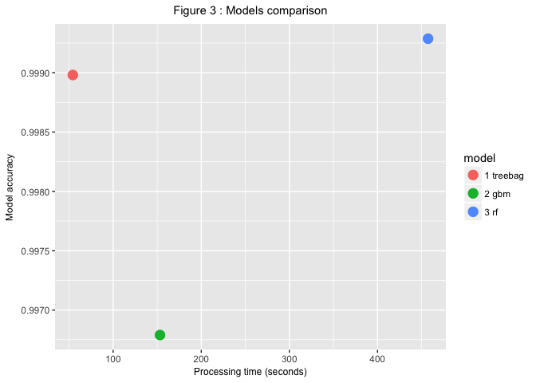

# Predicting human physical activity using sensors data
[Romain Faure](https://github.com/cdromain) (R 3.3.3, RStudio 1.0.136, OSX 10.11.6)  
March 2017  

# Introduction

Using personal *wearable* monitoring devices (such as Jawbone Up, Nike FuelBand, Fitbit...), it is now possible to collect a large amount of data about personal activity relatively inexpensively. These type of devices are part of the *quantified self movement* – a group of enthusiasts who take measurements about themselves regularly to improve their health or find patterns in their behavior. In parallel, Human Activity Recognition (HAR) has emerged as a key research area in the last years.

People tend to quantify how much of a particular activity they do, or discriminate between different activities, i.e. predict which activity they do at a specific point in time, but they rarely quantify how well they perform a specific activity. In this project, our goal will be to use the Weight Lifting Exercises Dataset, i.e. data from accelerometers sensors that were placed on the belt, forearm, arm, and dumbell of $6$ male participants (aged between 20-28 years), to predict how they actually did the exercise. 

The participants were asked to perform one set of 10 repetitions of the Unilateral Dumbbell Biceps Curl in $5$ different ways : correctly, i.e. exactly according to the specified execution of the exercise (class A), or incorrectly, like throwing the elbows to the front (class B), lifting the dumbbell only halfway (class C), lowering the dumbbell only halfway (class D) and throwing the hips to the front (class E).

Therefore, we are here dealing with a **classification** problem. More specifically, our goal in this project is to build a prediction model capable of identifying the manner in which the participants did the exercise (i.e. the `classe` variable, our outcome), classifying every observation in one of the $5$ classes, using the remaining variables in the training set.

More information is available from the website here: http://groupware.les.inf.puc-rio.br/har#weight_lifting_exercises 

# Loading the data and necessary packages

We start by downloading the data using the script below :


```r
## Data downloading

## check if a "data" directory exists in the current working directory
## and create it if not
downloaded <- FALSE

if (!file.exists("data")) { 
        dir.create("data")
}

if (!file.exists("./data/pml-training.csv")) { 
        dir.create("data")
        ## download the training data CSV file
        fileUrl1 <- "https://d396qusza40orc.cloudfront.net/predmachlearn/pml-training.csv"
        download.file(fileUrl1, "./data/pml-training.csv", method = "curl")
        downloaded <- TRUE
}

if (!file.exists("./data/pml-testing.csv")) { 
        ## download the test data CSV file
        fileUrl2 <- "https://d396qusza40orc.cloudfront.net/predmachlearn/pml-testing.csv"
        download.file(fileUrl2, "./data/pml-testing.csv", method = "curl")
        downloaded <- TRUE
}


if (downloaded == TRUE) {
        ## save and print the download time and date
        downloadedDate <- date()
}

print("Files downloaded on :")
```

```
## [1] "Files downloaded on :"
```

```r
print(downloadedDate)
```

```
## [1] "Sat Mar 18 20:06:40 2017"
```

We then load the packages necessary for our analysis, set the seed for reproducibility purposes and read in the downloaded training and test data CSV files (specifying that empty cells should be interpreted as NAs) :


```r
## Loading the necessary packages
library(caret)
library(randomForest)
library(VIM)
library(psych)
library(ggplot2)
library(parallel)
library(doParallel)

## setting the seed
set.seed(777)

## Reading in the training and test data files
training <- read.csv(file = "./data/pml-training.csv", header = TRUE, na.strings = c("", "NA"))
test <- read.csv(file = "./data/pml-testing.csv", header = TRUE, na.strings = c("", "NA"))
```

# Exploratory Data Analysis


```r
cat("Numbers of rows : "); nrow(training)
```

```
## Numbers of rows :
```

```
## [1] 19622
```

```r
cat("Numbers of columns : "); ncol(training)
```

```
## Numbers of columns :
```

```
## [1] 160
```


```r
aggr(training, col=c('blue','red'), numbers=TRUE, sortVars=TRUE, only.miss = TRUE, labels=names(training), varheight = TRUE, combined = TRUE, cex.lab = 1, cex.axis = .2, cex.numbers = 0.8, ylab=c("Figure 1 : Missing data (red) in the training set"))
```

<!-- -->

```
## 
##  Variables sorted by number of missings: 
##                  Variable Count
##        kurtosis_roll_belt 19216
##       kurtosis_picth_belt 19216
##         kurtosis_yaw_belt 19216
##        skewness_roll_belt 19216
##      skewness_roll_belt.1 19216
##         skewness_yaw_belt 19216
##             max_roll_belt 19216
##            max_picth_belt 19216
##              max_yaw_belt 19216
##             min_roll_belt 19216
##            min_pitch_belt 19216
##              min_yaw_belt 19216
##       amplitude_roll_belt 19216
##      amplitude_pitch_belt 19216
##        amplitude_yaw_belt 19216
##      var_total_accel_belt 19216
##             avg_roll_belt 19216
##          stddev_roll_belt 19216
##             var_roll_belt 19216
##            avg_pitch_belt 19216
##         stddev_pitch_belt 19216
##            var_pitch_belt 19216
##              avg_yaw_belt 19216
##           stddev_yaw_belt 19216
##              var_yaw_belt 19216
##             var_accel_arm 19216
##              avg_roll_arm 19216
##           stddev_roll_arm 19216
##              var_roll_arm 19216
##             avg_pitch_arm 19216
##          stddev_pitch_arm 19216
##             var_pitch_arm 19216
##               avg_yaw_arm 19216
##            stddev_yaw_arm 19216
##               var_yaw_arm 19216
##         kurtosis_roll_arm 19216
##        kurtosis_picth_arm 19216
##          kurtosis_yaw_arm 19216
##         skewness_roll_arm 19216
##        skewness_pitch_arm 19216
##          skewness_yaw_arm 19216
##              max_roll_arm 19216
##             max_picth_arm 19216
##               max_yaw_arm 19216
##              min_roll_arm 19216
##             min_pitch_arm 19216
##               min_yaw_arm 19216
##        amplitude_roll_arm 19216
##       amplitude_pitch_arm 19216
##         amplitude_yaw_arm 19216
##    kurtosis_roll_dumbbell 19216
##   kurtosis_picth_dumbbell 19216
##     kurtosis_yaw_dumbbell 19216
##    skewness_roll_dumbbell 19216
##   skewness_pitch_dumbbell 19216
##     skewness_yaw_dumbbell 19216
##         max_roll_dumbbell 19216
##        max_picth_dumbbell 19216
##          max_yaw_dumbbell 19216
##         min_roll_dumbbell 19216
##        min_pitch_dumbbell 19216
##          min_yaw_dumbbell 19216
##   amplitude_roll_dumbbell 19216
##  amplitude_pitch_dumbbell 19216
##    amplitude_yaw_dumbbell 19216
##        var_accel_dumbbell 19216
##         avg_roll_dumbbell 19216
##      stddev_roll_dumbbell 19216
##         var_roll_dumbbell 19216
##        avg_pitch_dumbbell 19216
##     stddev_pitch_dumbbell 19216
##        var_pitch_dumbbell 19216
##          avg_yaw_dumbbell 19216
##       stddev_yaw_dumbbell 19216
##          var_yaw_dumbbell 19216
##     kurtosis_roll_forearm 19216
##    kurtosis_picth_forearm 19216
##      kurtosis_yaw_forearm 19216
##     skewness_roll_forearm 19216
##    skewness_pitch_forearm 19216
##      skewness_yaw_forearm 19216
##          max_roll_forearm 19216
##         max_picth_forearm 19216
##           max_yaw_forearm 19216
##          min_roll_forearm 19216
##         min_pitch_forearm 19216
##           min_yaw_forearm 19216
##    amplitude_roll_forearm 19216
##   amplitude_pitch_forearm 19216
##     amplitude_yaw_forearm 19216
##         var_accel_forearm 19216
##          avg_roll_forearm 19216
##       stddev_roll_forearm 19216
##          var_roll_forearm 19216
##         avg_pitch_forearm 19216
##      stddev_pitch_forearm 19216
##         var_pitch_forearm 19216
##           avg_yaw_forearm 19216
##        stddev_yaw_forearm 19216
##           var_yaw_forearm 19216
##                         X     0
##                 user_name     0
##      raw_timestamp_part_1     0
##      raw_timestamp_part_2     0
##            cvtd_timestamp     0
##                new_window     0
##                num_window     0
##                 roll_belt     0
##                pitch_belt     0
##                  yaw_belt     0
##          total_accel_belt     0
##              gyros_belt_x     0
##              gyros_belt_y     0
##              gyros_belt_z     0
##              accel_belt_x     0
##              accel_belt_y     0
##              accel_belt_z     0
##             magnet_belt_x     0
##             magnet_belt_y     0
##             magnet_belt_z     0
##                  roll_arm     0
##                 pitch_arm     0
##                   yaw_arm     0
##           total_accel_arm     0
##               gyros_arm_x     0
##               gyros_arm_y     0
##               gyros_arm_z     0
##               accel_arm_x     0
##               accel_arm_y     0
##               accel_arm_z     0
##              magnet_arm_x     0
##              magnet_arm_y     0
##              magnet_arm_z     0
##             roll_dumbbell     0
##            pitch_dumbbell     0
##              yaw_dumbbell     0
##      total_accel_dumbbell     0
##          gyros_dumbbell_x     0
##          gyros_dumbbell_y     0
##          gyros_dumbbell_z     0
##          accel_dumbbell_x     0
##          accel_dumbbell_y     0
##          accel_dumbbell_z     0
##         magnet_dumbbell_x     0
##         magnet_dumbbell_y     0
##         magnet_dumbbell_z     0
##              roll_forearm     0
##             pitch_forearm     0
##               yaw_forearm     0
##       total_accel_forearm     0
##           gyros_forearm_x     0
##           gyros_forearm_y     0
##           gyros_forearm_z     0
##           accel_forearm_x     0
##           accel_forearm_y     0
##           accel_forearm_z     0
##          magnet_forearm_x     0
##          magnet_forearm_y     0
##          magnet_forearm_z     0
##                    classe     0
```


```r
cat("\n classe variable :\n")
```

```
## 
##  classe variable :
```

```r
str(training$classe)
```

```
##  Factor w/ 5 levels "A","B","C","D",..: 1 1 1 1 1 1 1 1 1 1 ...
```

```r
summary(training$classe)
```

```
##    A    B    C    D    E 
## 5580 3797 3422 3216 3607
```

3. Data Pre-processing and features selection


```r
## Select the columns with NAs or empty values
#trainingOk <- apply(training, 2, function(x) gsub("^$|^ $", NA, x))

colNA <- c()

for(i in 1:ncol(training)) {
        if (sum(is.na(training[,i])) > 0) {
                colNA <- c(colNA, i)
        }
}
```

We just saw that the training set has 100 empty columns, which we can see as silent (i.e. unsignificant) noise which would perturb our prediction models. Therefore, missing values in the training set should be handled before we can train our models, which means either imputing them or subsetting them out from the training set. Given the large number of mostly empty columns, imputation does not appear to be the best strategy, therefore we decide to subset the training set to only keep the complete columns (in blue in the plot above), using a `for` loop to determine which variables do not contain missing values, in order to use the complete columns as predictors to build our models.

We also remove the first column of the `training` data frame, `X`, (i.e. the row id number), as keeping it in our models would result in overfitting. In other words, it would hinder our model generalization ability. In the case of our test set, keeping the `X` variable as a predictor would lead the model to predict only `A` for the $20$ test observations, which seems to be a clear symptom of overfitting (as the observations in the training set are ordered by class, i.e. starting with `A`). We finally remove the second variable `user_name` as well, as it does not seem like a useful feature for generalization and prediction purposes (where new data would probably mean new users, i.e. new user names).

> We also considered removing the $3$ timestamps variables, as keeping them as predictors seems like it might limit the future generalization ability of our models. But as removing them slightly reduces the resulting models accuracy, we decide to keep them to maximize the accuracy in the specific context of this assignment.

This results in a new training set (`trainingOk`) containing only $58$ variables that we'll use as predictors :


```r
## Subsetting the training set to remove the columns with NAs 
## as well as the first column (X)
trainingOk <- training[, -c(1:2, colNA)]

cat("Numbers of columns : "); ncol(trainingOk)
```

```
## Numbers of columns :
```

```
## [1] 58
```

```r
cat("\n")
```

```r
describe(trainingOk, skew = FALSE, ranges = FALSE)[1:2]
```

```
##                      vars     n
## raw_timestamp_part_1    1 19622
## raw_timestamp_part_2    2 19622
## cvtd_timestamp*         3 19622
## new_window*             4 19622
## num_window              5 19622
## roll_belt               6 19622
## pitch_belt              7 19622
## yaw_belt                8 19622
## total_accel_belt        9 19622
## gyros_belt_x           10 19622
## gyros_belt_y           11 19622
## gyros_belt_z           12 19622
## accel_belt_x           13 19622
## accel_belt_y           14 19622
## accel_belt_z           15 19622
## magnet_belt_x          16 19622
## magnet_belt_y          17 19622
## magnet_belt_z          18 19622
## roll_arm               19 19622
## pitch_arm              20 19622
## yaw_arm                21 19622
## total_accel_arm        22 19622
## gyros_arm_x            23 19622
## gyros_arm_y            24 19622
## gyros_arm_z            25 19622
## accel_arm_x            26 19622
## accel_arm_y            27 19622
## accel_arm_z            28 19622
## magnet_arm_x           29 19622
## magnet_arm_y           30 19622
## magnet_arm_z           31 19622
## roll_dumbbell          32 19622
## pitch_dumbbell         33 19622
## yaw_dumbbell           34 19622
## total_accel_dumbbell   35 19622
## gyros_dumbbell_x       36 19622
## gyros_dumbbell_y       37 19622
## gyros_dumbbell_z       38 19622
## accel_dumbbell_x       39 19622
## accel_dumbbell_y       40 19622
## accel_dumbbell_z       41 19622
## magnet_dumbbell_x      42 19622
## magnet_dumbbell_y      43 19622
## magnet_dumbbell_z      44 19622
## roll_forearm           45 19622
## pitch_forearm          46 19622
## yaw_forearm            47 19622
## total_accel_forearm    48 19622
## gyros_forearm_x        49 19622
## gyros_forearm_y        50 19622
## gyros_forearm_z        51 19622
## accel_forearm_x        52 19622
## accel_forearm_y        53 19622
## accel_forearm_z        54 19622
## magnet_forearm_x       55 19622
## magnet_forearm_y       56 19622
## magnet_forearm_z       57 19622
## classe*                58 19622
```

# Modeling strategy and model selection

- Given that we are dealing with a non-binary classification problem (5 classes), we decide to work with and compare the performance of  three tree-based ensembling types of methods : bagging (model 1), boosting (model 2) and random forest (model 3).

1. `method = "treebag"` - Bagged CART, more specifically bagging classification trees with bootstrap replications.

2. `method = "gbm"` - A stochastic gradient boosted model with multinomial loss function.

3. `method = "rf"` : Random forest algorithm.

- **Cross-validation** : we decide to use cross-validation as part of our models training to limit overfitting and get an OOB error rate estimate. 5-fold cross-validation seems enough, as using a classical value of `k = 10` doubles the processing time for only a marginal accuracy improvement with two of our three models : $+ 0.02\%$ with the bagged CART and the random forest algorithms but $- 0.03\%$ with GBM. As a value of $k = 5$ already means more than $7$ minutes of computation for the random forest algorithm (on the computer we're using) and satisfactory accuracy results, we decide to use 5-fold cross validation.

5 fold cross validation : accuracy / processing time (elapsed)
1 Treebag : 0.9989808 / 57.623 sec
2 GBM : 0.9970953 / 163.605 sec
3 RF : 0.9992866 / 480.586 sec

10 fold cross validation : accuracy / processing time (elapsed)
1 Treebag : 0.9991845 (+ 0.0002037) / 92.013 sec
2 GBM : 0.9968405 (- 0.0002548) / 299.202 sec
3 RF : 0.9994394 (+ 0.0001528) / 963.143 sec

- **Algorithms parameters** : using the default algorithms parameters led to a sufficient accuracy, so we did not change them.

- **Parallel processing** : we use parallel processing to speed up the processing time required to train our models. Especially useful since :
        
        - the training set is fairly large (almost $20000$ observations)
        - the algorithms we chose are fairly intensive (especially random forest)
        - the computer the analysis is run on has $4$ cores.
        
To enable parallel processing, we follow the [procedure described by the T.A. Len Greski](https://github.com/lgreski/datasciencectacontent/blob/master/markdown/pml-randomForestPerformance.md), using the packages `parallel` and `doParallel`.


```r
## Configure parallel processing
cluster <- makeCluster(detectCores() - 1) # convention to leave 1 core for OS
registerDoParallel(cluster)

## Configure trainControl object
fitControl <- trainControl(method = "cv", number = 5, 
                           allowParallel = TRUE)

## Building model 1 (bagged CART)
mod1bag <- train(classe ~ ., data = trainingOk, 
                 method = "treebag", trControl = fitControl)
pred1bag <- predict(mod1bag, trainingOk)
mod1bag # printing the resulting model
```

```
## Bagged CART 
## 
## 19622 samples
##    57 predictor
##     5 classes: 'A', 'B', 'C', 'D', 'E' 
## 
## No pre-processing
## Resampling: Cross-Validated (5 fold) 
## Summary of sample sizes: 15699, 15698, 15697, 15696, 15698 
## Resampling results:
## 
##   Accuracy   Kappa    
##   0.9989808  0.9987108
## 
## 
```

```r
## Building model 2 (gbm)
mod2gbm <- train(classe ~ ., data = trainingOk, 
                 method = "gbm", trControl = fitControl, 
                 verbose = FALSE)
pred2gbm <- predict(mod2gbm, trainingOk)
mod2gbm
```

```
## Stochastic Gradient Boosting 
## 
## 19622 samples
##    57 predictor
##     5 classes: 'A', 'B', 'C', 'D', 'E' 
## 
## No pre-processing
## Resampling: Cross-Validated (5 fold) 
## Summary of sample sizes: 15699, 15697, 15698, 15697, 15697 
## Resampling results across tuning parameters:
## 
##   interaction.depth  n.trees  Accuracy   Kappa    
##   1                   50      0.8386999  0.7953414
##   1                  100      0.8992970  0.8724693
##   1                  150      0.9280909  0.9089078
##   2                   50      0.9575989  0.9463184
##   2                  100      0.9871575  0.9837550
##   2                  150      0.9921009  0.9900088
##   3                   50      0.9838959  0.9796278
##   3                  100      0.9936807  0.9920071
##   3                  150      0.9967895  0.9959393
## 
## Tuning parameter 'shrinkage' was held constant at a value of 0.1
## 
## Tuning parameter 'n.minobsinnode' was held constant at a value of 10
## Accuracy was used to select the optimal model using  the largest value.
## The final values used for the model were n.trees = 150,
##  interaction.depth = 3, shrinkage = 0.1 and n.minobsinnode = 10.
```

```r
## Building model 3 (random forest)
mod3rf <- train(classe ~ ., data = trainingOk, 
                method = "rf", trControl = fitControl)
pred3rf <- predict(mod3rf, trainingOk)
mod3rf
```

```
## Random Forest 
## 
## 19622 samples
##    57 predictor
##     5 classes: 'A', 'B', 'C', 'D', 'E' 
## 
## No pre-processing
## Resampling: Cross-Validated (5 fold) 
## Summary of sample sizes: 15698, 15698, 15696, 15697, 15699 
## Resampling results across tuning parameters:
## 
##   mtry  Accuracy   Kappa    
##    2    0.9942411  0.9927150
##   38    0.9992865  0.9990976
##   75    0.9988280  0.9985176
## 
## Accuracy was used to select the optimal model using  the largest value.
## The final value used for the model was mtry = 38.
```

```r
## De-register parallel processing cluster
stopCluster(cluster)
registerDoSEQ()
```

We can then make a plot comparing the resulting accuracy and processing time of each of our three prediction models :


```r
modComp <- data.frame(x = c(mod1bag$times[[1]][3], mod2gbm$times[[1]][3], mod3rf$times[[1]][3]), y = c(mod1bag$results[[2]], mod2gbm$results[9, 5], mod3rf$results[2, 2]), model = c("1 treebag", "2 gbm", "3 rf"))

g <- ggplot(modComp, aes(x = x, y = y, colour = model))
g <- g + geom_point(size = 4)

g <- g + ggtitle("Figure 2 : Models comparison") 
g + theme(plot.title = element_text(hjust=0.5, size = 10), 
                 axis.title = element_text(size = 8)) + 
        labs(x = "Processing time (seconds)", y = "Model accuracy")
```

<!-- -->

We decide to use a random forest algorithm (`rf`) for our final prediction model as its accuracy was the highest, then followed by the Bagged CART (`treebag`) and finally GBM. Note that random forest was also by far the most processing-intensive algorithm out of the three. The bagged CART model could have been an interesting compromise as its accuracy is close to the random forest's, but only requires one eighth of the computing time required by the random forest. But in the specific context of this assignment we decide to stay with the most accurate model, i.e. the random forest.

# Results

The final random forest model used the following parameters : `mtry = 38`, `n.trees = 150`, `interaction.depth = 3`, `shrinkage = 0.1` and `n.minobsinnode = 10`. 

We can see that `mtry = 38` corresponds to the optimal value according to the random forest algorithm predictors random selection (increasing the parameter value decreases the resulting accuracy) :


```r
plot(mod3rf, main = "Figure 3 : Final model predictors random selection")
```

<!-- -->

Our final random forest-based model enables us to correctly predict the `classe` of $100\%$ of the training observations, with a $(0.9998, 1)$ confidence interval (as well as the $20$ test cases part of the prediction quiz) :


```r
confusionMatrix(pred3rf, trainingOk$classe)
```

```
## Confusion Matrix and Statistics
## 
##           Reference
## Prediction    A    B    C    D    E
##          A 5580    0    0    0    0
##          B    0 3797    0    0    0
##          C    0    0 3422    0    0
##          D    0    0    0 3216    0
##          E    0    0    0    0 3607
## 
## Overall Statistics
##                                      
##                Accuracy : 1          
##                  95% CI : (0.9998, 1)
##     No Information Rate : 0.2844     
##     P-Value [Acc > NIR] : < 2.2e-16  
##                                      
##                   Kappa : 1          
##  Mcnemar's Test P-Value : NA         
## 
## Statistics by Class:
## 
##                      Class: A Class: B Class: C Class: D Class: E
## Sensitivity            1.0000   1.0000   1.0000   1.0000   1.0000
## Specificity            1.0000   1.0000   1.0000   1.0000   1.0000
## Pos Pred Value         1.0000   1.0000   1.0000   1.0000   1.0000
## Neg Pred Value         1.0000   1.0000   1.0000   1.0000   1.0000
## Prevalence             0.2844   0.1935   0.1744   0.1639   0.1838
## Detection Rate         0.2844   0.1935   0.1744   0.1639   0.1838
## Detection Prevalence   0.2844   0.1935   0.1744   0.1639   0.1838
## Balanced Accuracy      1.0000   1.0000   1.0000   1.0000   1.0000
```

Finally, we can plot our final model variables importance. The x-axis represents the total decrease in node impurities from splitting on the variable, averaged over all trees, and measured by the Gini index (as this is a classification task) : 


```r
varImpPlot(mod3rf$finalModel, n.var = 20, type = 2, cex = 0.7, color = "blue", main = "Figure 4 : Final model (random forest) variables importance")
```

<!-- -->


```r
mod3rf$finalModel
```

```
## 
## Call:
##  randomForest(x = x, y = y, mtry = param$mtry) 
##                Type of random forest: classification
##                      Number of trees: 500
## No. of variables tried at each split: 38
## 
##         OOB estimate of  error rate: 0.05%
## Confusion matrix:
##      A    B    C    D    E  class.error
## A 5580    0    0    0    0 0.0000000000
## B    1 3794    2    0    0 0.0007900974
## C    0    3 3419    0    0 0.0008766803
## D    0    0    2 3213    1 0.0009328358
## E    0    0    0    1 3606 0.0002772387
```

Using **5-fold cross validation** when building our models gives us an estimate of the out of sample error (OOB, out-of-bag), as for each fold the model is trained on $\frac{4}{5}$ of the training data and then tested on the held-out remaining $\frac{1}{5}$. The resulting out of sample error (OOB) estimate seems quite low ($0.05\%$), but we would need more than $6$ individuals in our training data to increase the generalization, i.e. prediction abilities of our model. We might also need a larger test set containing more than $20$ observations to confirm the out of sample accuracy. 
